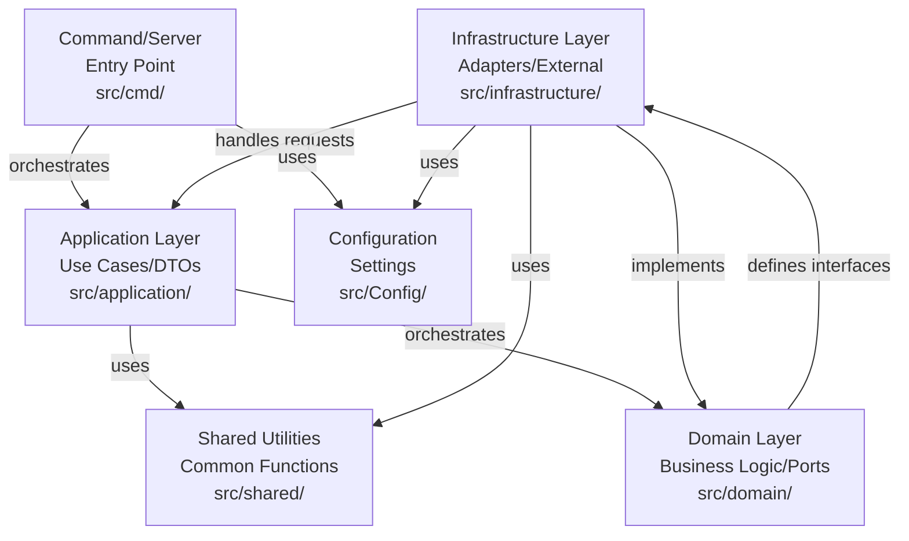
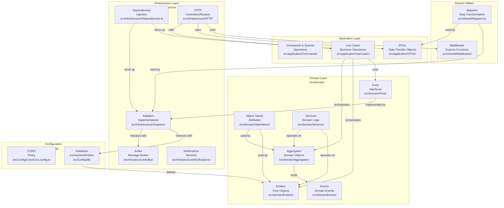
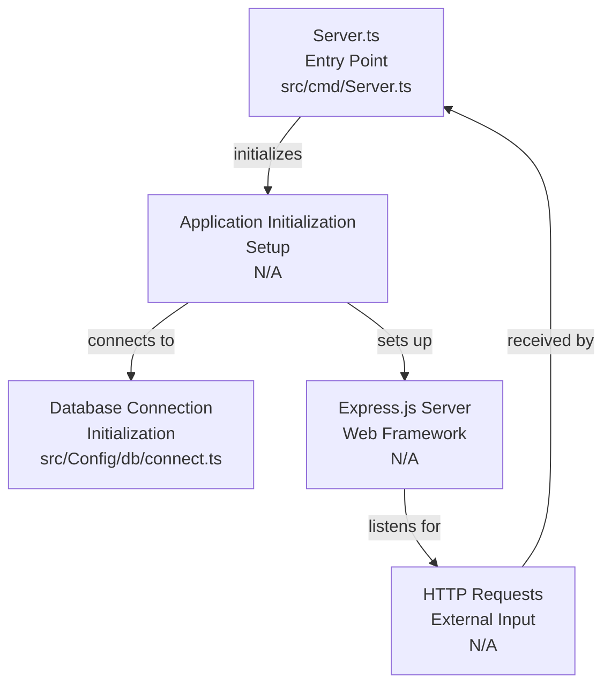

# Codebase Research Report

## Query
De toda mi app

## Answer
# MicroservicioAprendizaje Codebase Overview

## High-Level Architecture

The **MicroservicioAprendizaje** is structured following a layered architectural pattern, likely a variation of Domain-Driven Design (DDD) or Clean Architecture, emphasizing separation of concerns. It primarily consists of three core layers: **Application**, **Domain**, and **Infrastructure**, orchestrated by a central command/server entry point.

*   **Application Layer**: Contains the application's use cases and Data Transfer Objects (DTOs), defining the specific functionalities exposed by the service.
*   **Domain Layer**: Encapsulates the core business logic, entities, aggregates, value objects, and interfaces (ports) that define how the domain interacts with external concerns. This layer is independent of any specific technology.
*   **Infrastructure Layer**: Provides the concrete implementations (adapters) for the domain's ports, handling external interactions such as database persistence, HTTP communication, and message brokering (Kafka).
*   **Configuration**: Manages application-wide settings, including database connections and CORS policies.
*   **Shared Utilities**: Houses common functionalities like data mappers and middleware.
*   **Command/Server**: The entry point that initializes and starts the application, typically an HTTP server.

Data flows generally from the **Infrastructure** (HTTP controllers) to the **Application** (use cases), which then orchestrates the **Domain** logic. The **Domain** defines interfaces (ports) that are implemented by **Infrastructure** (adapters) to interact with external systems like databases.

## Core Components

### Application Layer

The **Application Layer** ([src/application/](src/application/)) defines the application's capabilities and orchestrates the domain objects to fulfill use cases. It contains:

*   **Commands and Queries**:
    *   [CommandsEscritura.ts](src/application/Commands/CommandsEscritura.ts): Likely defines commands for write operations (e.g., creating, updating).
    *   [QueriesLectura.ts](src/application/Commands/QueriesLectura.ts): Likely defines queries for read operations.
*   **DTOs (Data Transfer Objects)** ([src/application/DTOs/](src/application/DTOs/)): These objects are used to transfer data between the application layer and external interfaces (e.g., HTTP controllers). Examples include [CrearLeccionDto.ts](src/application/DTOs/CrearLeccionDto.ts), [ActualizarEjercicioDto.ts](src/application/DTOs/ActualizarEjercicioDto.ts), and [LeccionResponseDto.ts](src/application/DTOs/LeccionResponseDto.ts).
*   **Use Cases** ([src/application/UseCases/](src/application/UseCases/)): Each use case represents a specific business operation. They coordinate the flow of data to and from the domain layer. Examples include [CrearLeccionUseCase.ts](src/application/UseCases/CrearLeccionUseCase.ts), [ResolverEjercicioUseCase.ts](src/application/UseCases/ResolverEjercicioUseCase.ts), and [ConsultarProgresoUseCase.ts](src/application/UseCases/ConsultarProgresoUseCase.ts).

### Domain Layer

The **Domain Layer** ([src/domain/](src/domain/)) is the core of the business logic, independent of any external concerns.

*   **Aggregates** ([src/domain/Aggregates/](src/domain/Aggregates/)): Represent clusters of domain objects that are treated as a single unit for data changes. [Leccion.ts](src/domain/Aggregates/Leccion.ts) is an example.
*   **Entities** ([src/domain/Entities/](src/domain/Entities/)): Core business objects with identity. Examples include [Ejercicio.ts](src/domain/Entities/Ejercicio.ts) and [RespuestaUsuario.ts](src/domain/Entities/RespuestaUsuario.ts).
*   **Events** ([src/domain/Events/](src/domain/Events/)): Represent something that happened in the domain that other parts of the system might be interested in. [DomainEvent.ts](src/domain/Events/DomainEvent.ts) defines the base.
*   **Object Values** ([src/domain/ObjetValues/](src/domain/ObjetValues/)): Objects that describe a characteristic or attribute but have no conceptual identity. Examples include [NivelDificultad.ts](src/domain/ObjetValues/NivelDificultad.ts) and [ResultadoRespuesta.ts](src/domain/ObjetValues/ResultadoRespuesta.ts).
*   **Ports** ([src/domain/Ports/](src/domain/Ports/)): Define interfaces that the domain needs to interact with external systems (e.g., databases, message brokers). These are implemented by adapters in the infrastructure layer. Examples include [LeccionRepository.ts](src/domain/Ports/LeccionRepository.ts) and [EventPublisher.ts](src/domain/Ports/EventPublisher.ts).
*   **Services** ([src/domain/Services/](src/domain/Services/)): Contain domain logic that doesn't naturally fit within an entity or aggregate. Examples are [ServicioDeEvaluacion.ts](src/domain/Services/ServicioDeEvaluacion.ts) and [ServicioDeProgreso.ts](src/domain/Services/ServicioDeProgreso.ts).

### Infrastructure Layer

The **Infrastructure Layer** ([src/infrastructure/](src/infrastructure/)) provides the concrete implementations for the domain's ports and handles external interactions.

*   **Dependencies** ([src/infrastructure/Dependencies.ts](src/infrastructure/Dependencies.ts)): Likely handles dependency injection and wiring up the application components.
*   **Adapters** ([src/infrastructure/Adapters/](src/infrastructure/Adapters/)): Implementations of the domain ports, connecting the domain to specific technologies. Examples include [TypeOrmLeccionRepository.ts](src/infrastructure/Adapters/TypeOrmLeccionRepository.ts) (for database persistence) and [KafkaEventPublisher.ts](src/infrastructure/Adapters/KafkaEventPublisher.ts) (for event publishing).
*   **HTTP** ([src/infrastructure/HTTP/](src/infrastructure/HTTP/)): Handles incoming HTTP requests and outgoing responses.
    *   **Controllers** ([src/infrastructure/HTTP/Controllers/](src/infrastructure/HTTP/Controllers/)): Receive requests, call application use cases, and return responses. Examples include [LeccionControlle.ts](src/infrastructure/HTTP/Controllers/LeccionControlle.ts) and [EjercicioController.ts](src/infrastructure/HTTP/Controllers/EjercicioController.ts).
    *   **Routers** ([src/infrastructure/HTTP/Routers/](src/infrastructure/HTTP/Routers/)): Define API routes and map them to controllers. Examples are [routerLeccion.ts](src/infrastructure/HTTP/Routers/routerLeccion.ts) and [routerEjercicios.ts](src/infrastructure/HTTP/Routers/routerEjercicios.ts).
*   **Kafka** ([src/infrastructure/kafka/](src/infrastructure/kafka/)): Contains the Kafka client for message brokering. [KafkaClient.ts](src/infrastructure/kafka/KafkaClient.ts) is the main file.
*   **Notifications** ([src/infrastructure/Notifications/](src/infrastructure/Notifications/)): A placeholder for notification services.

### Configuration

The **Config** directory ([src/Config/](src/Config/)) holds application-wide configuration settings.

*   **CORS** ([src/Config/Cors/Cors.config.ts](src/Config/Cors/Cors.config.ts)): Defines Cross-Origin Resource Sharing policies.
*   **Database** ([src/Config/db/](src/Config/db/)):
    *   [connect.ts](src/Config/db/connect.ts): Handles the database connection setup.
    *   [entities/](src/Config/db/entities/): Defines the TypeORM entities that map to database tables, such as [LeccionEntity.ts](src/Config/db/entities/LeccionEntity.ts) and [EjercicioEntity.ts](src/Config/db/entities/EjercicioEntity.ts).

### Shared Utilities

The **Shared** directory ([src/shared/](src/shared/)) contains common utilities used across different layers.

*   [Mappers.ts](src/shared/Mappers.ts): Provides utility functions for mapping data between different object types (e.g., DTOs to domain entities).
*   **Middleware** ([src/shared/Middleware/](src/shared/Middleware/)): Contains Express middleware functions, such as [auth-middleware.ts](src/shared/Middleware/auth-middleware.ts) for authentication.

## Entry Point

The application's entry point is likely handled by the **cmd** directory ([src/cmd/](src/cmd/)).
*   [Server.ts](src/cmd/Server.ts): This file is responsible for initializing the application, setting up the server (e.g., Express.js), connecting to the database, and starting to listen for incoming requests.

---
*Generated by [CodeViz.ai](https://codeviz.ai) on 7/6/2025, 4:58:32 AM*
