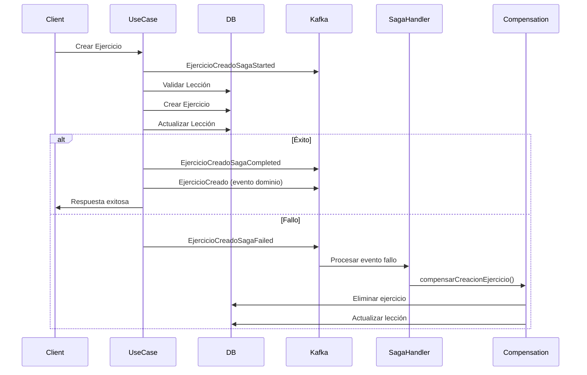

# Implementación del Patrón SAGA en MicroservicioAprendizaje

## Resumen

Se ha implementado el **patrón SAGA basado en eventos (Choreography SAGA)** en el microservicio de aprendizaje para manejar transacciones distribuidas de manera automática y sin necesidad de un orquestador central.

## Arquitectura Implementada

### 1. Eventos SAGA

Se han creado eventos específicos para cada operación SAGA:

#### CrearEjercicio SAGA
- `EjercicioCreadoSagaStarted`: Inicia la transacción
- `EjercicioCreadoSagaCompleted`: Confirma éxito
- `EjercicioCreadoSagaFailed`: Indica fallo
- `EjercicioCreadoSagaCompensated`: Confirma compensación

#### ResolverEjercicio SAGA
- `EjercicioResueltoSagaStarted`: Inicia la transacción
- `EjercicioResueltoSagaCompleted`: Confirma éxito
- `EjercicioResueltoSagaFailed`: Indica fallo
- `EjercicioResueltoSagaCompensated`: Confirma compensación

#### ActualizarProgreso SAGA
- `ProgresoActualizadoSagaStarted`: Inicia la transacción
- `ProgresoActualizadoSagaCompleted`: Confirma éxito
- `ProgresoActualizadoSagaFailed`: Indica fallo

### 2. Servicio de Compensación

El `SagaCompensationService` maneja los rollbacks automáticos:

```typescript
interface SagaCompensationService {
  compensarCreacionEjercicio(ejercicioId: string, leccionId: string): Promise<void>;
  compensarResolucionEjercicio(respuestaId: string, ejercicioId: string): Promise<void>;
  compensarActualizacionProgreso(usuarioId: string, leccionId: string): Promise<void>;
}
```

### 3. Manejador de Eventos SAGA

El `SagaEventHandler` escucha eventos de fallo y ejecuta compensaciones automáticamente:

- Se conecta a Kafka para escuchar eventos
- Procesa eventos de fallo automáticamente
- Ejecuta las compensaciones correspondientes
- Registra logs detallados del proceso

## Flujo de Operación

### Ejemplo: CrearEjercicio SAGA



### Pasos de Compensación

1. **CrearEjercicio**: Elimina el ejercicio y actualiza la lección
2. **ResolverEjercicio**: Elimina la respuesta del usuario
3. **ActualizarProgreso**: Registra la compensación (sin cambios de estado)

## Características Clave

### ✅ Automático
- No requiere orquestador central
- Los eventos manejan la coordinación
- Compensaciones automáticas en caso de fallo

### ✅ Resiliente
- Manejo de errores robusto
- Rollbacks automáticos
- Logs detallados para debugging

### ✅ Escalable
- Basado en eventos asíncronos
- Desacoplamiento entre servicios
- Fácil extensión para nuevos casos

### ✅ Transparente
- Los Use Cases mantienen su lógica original
- SAGA se ejecuta en paralelo
- No afecta la API pública

## Configuración

### Variables de Entorno Requeridas

```env
BROKER=localhost:9092
CLIENT_ID=microservicio-aprendizaje
```

### Inicialización

El SAGA se inicia automáticamente al arrancar el servidor:

```typescript
// En index.ts
await sagaEventHandler.startListening();
console.log("[SAGA] Event handler iniciado correctamente");
```

## Monitoreo

### Health Check

El endpoint `/health` incluye el estado del SAGA:

```json
{
  "status": "ok",
  "service": "aprendizaje-service",
  "database": "connected",
  "saga": "active"
}
```

### Logs

Todos los eventos SAGA se registran con el prefijo `[SAGA]`:

```
[SAGA] Event handler iniciado correctamente
[SAGA] Procesando evento: EjercicioCreadoSagaFailed
[SAGA] Ejecutando compensación para EjercicioCreadoSagaFailed
[SAGA] Compensando creación de ejercicio: ejercicio-123
[SAGA] Compensación de creación de ejercicio completada: ejercicio-123
```

## Casos de Uso Implementados

### 1. CrearEjercicioUseCase
- **Transacción**: Crear ejercicio + Actualizar lección
- **Compensación**: Eliminar ejercicio + Revertir lección

### 2. ResolverEjercicioUseCase
- **Transacción**: Evaluar + Guardar respuesta
- **Compensación**: Eliminar respuesta

### 3. ActualizarProgresoUseCase
- **Transacción**: Calcular + Publicar progreso
- **Compensación**: Solo registro (sin cambios de estado)

## Ventajas de esta Implementación

1. **Simplicidad**: No requiere orquestador complejo
2. **Confiabilidad**: Compensaciones automáticas
3. **Mantenibilidad**: Código limpio y separado
4. **Observabilidad**: Logs detallados y métricas
5. **Escalabilidad**: Arquitectura basada en eventos

## Consideraciones Futuras

- Implementar retry policies para compensaciones fallidas
- Agregar métricas y alertas para eventos SAGA
- Implementar dead letter queue para eventos no procesados
- Agregar tests unitarios para servicios de compensación 